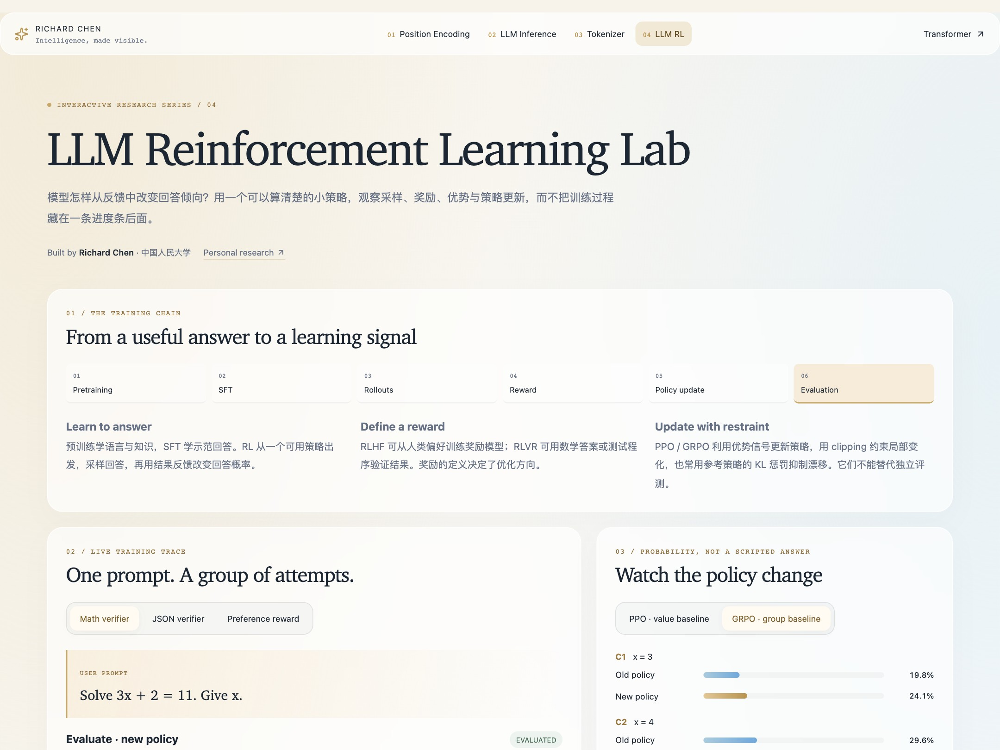
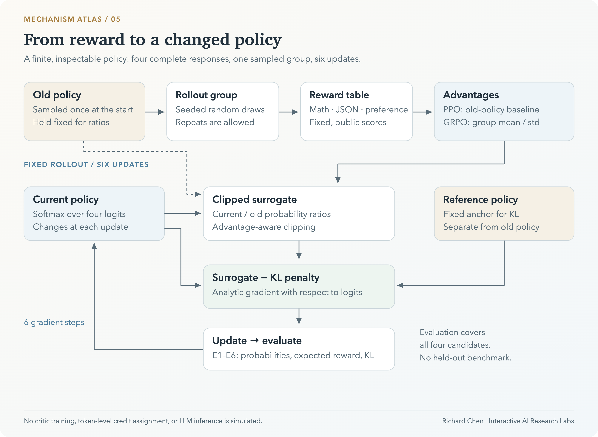
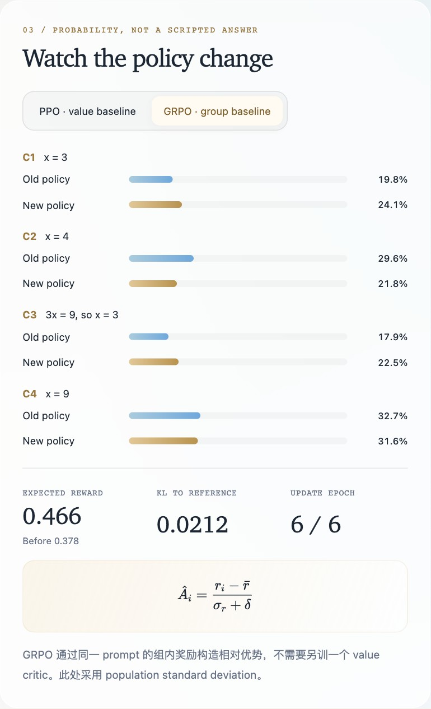
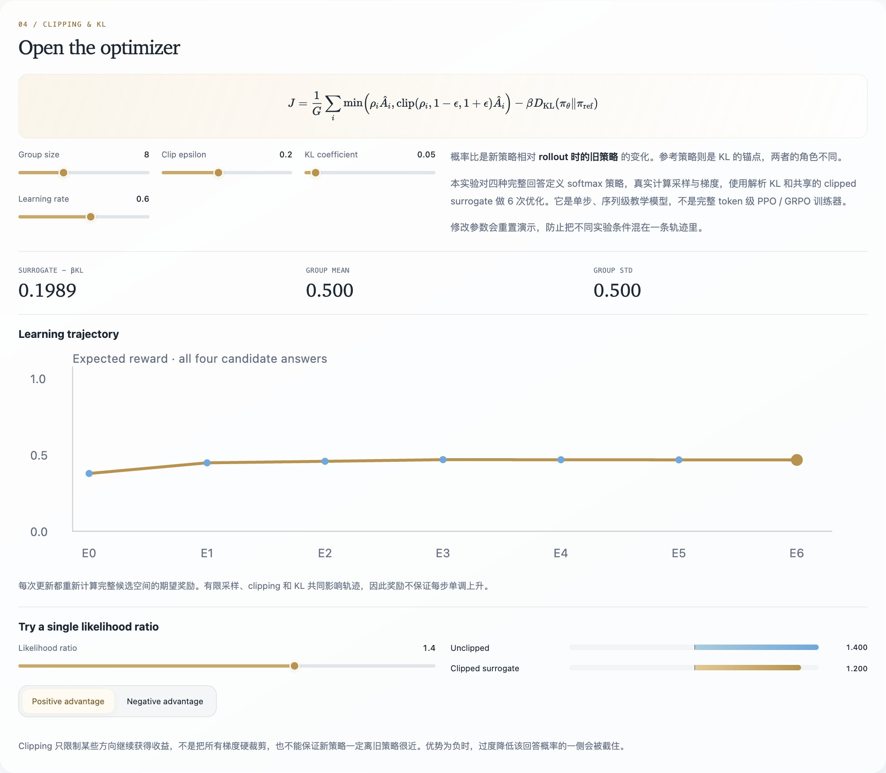

# LLM Reinforcement Learning Lab

**From reward to policy updates: understand how PPO and GRPO learn.**

An executable, finite-action view of language-model reinforcement learning: sample responses, assign rewards, compute advantages, optimize a clipped objective, and inspect the updated policy. Every probability and gradient in the small experiment can be checked.

[**Open the lab ↗**](https://richardchen99.github.io/llm-rl-lab/) · [Research note · 中文](https://richardchen99.github.io/blog/llm-rl-lab-note/) · [简体中文](README.md) · [Quick start](#quick-start)

Created by **Richard Chen · Renmin University of China / 中国人民大学** · [Homepage](https://richardchen99.github.io)

[](https://richardchen99.github.io/llm-rl-lab/)

*Real application capture: sampled responses connect to reward, advantage, policy movement, and exact finite-space evaluation.*

## The learning signal, made inspectable

| Experiment | Intervention | What to inspect |
| --- | --- | --- |
| **Seeded rollout** | Change the seed or resample the group | Repeated responses and finite-sample variation |
| **PPO / GRPO** | Switch the advantage baseline | How the same rewards become different learning signals |
| **Policy updates** | Adjust group size, learning rate, clipping, and KL | Six real logit updates and their probability trajectories |
| **Clipping explorer** | Change the ratio and advantage sign | Which side of the surrogate objective is clipped |
| **Evaluation** | Compare E0–E6 | Exact expected reward and KL over the four-response space |

The training overview places pretraining, SFT, rollout, reward, policy updates, and evaluation in context. The numerical experiment focuses on the policy-update loop. English controls are paired with Chinese explanations.

## Experimental framework



*Original schematic: the sampling policy and reference policy have distinct roles in one inspectable update loop. [Editable SVG](docs/assets/architecture.en.svg) · [Figure provenance · 中文](docs/assets/README.md).*

## Reproduce a six-update run

1. Choose **Math verifier** and **GRPO**, with seed **42**, group size **8**, clip epsilon **0.2**, KL coefficient **0.05**, and learning rate **0.6**.
2. Step through sampling, reward, and advantage before continuing to policy updates.
3. At **Evaluate**, inspect E0–E6. In this configuration, expected reward moves from approximately **0.378 to 0.466**, with final reference KL approximately **0.0212**.
4. Keep the seed and group size fixed, then switch to PPO to inspect the baseline change.
5. Resample the group or change a control to rebuild the trajectory. In the clipping explorer, try a negative advantage with a ratio below the lower bound.

These values describe this finite experiment, not a language-model benchmark. All six updates reuse the same sampled group; expected reward is evaluated over all four candidate responses, not on a held-out set.

<details>
<summary><strong>Inspect the policy movement and optimizer</strong></summary>



*Probability mass moves among four complete candidate responses.*



*Clipping and KL influence the update; they do not guarantee monotonic reward improvement.*

</details>

## Reward tasks

| Task | Prompt | Public reward rule |
| --- | --- | --- |
| **Math verifier** | `Solve 3x + 2 = 11. Give x.` | Correct predefined answers receive 1; incorrect ones receive 0 |
| **JSON verifier** | `What is 17 + 25? Return only a JSON object with key "answer".` | Among the predefined candidates, valid JSON with numeric answer 42 receives 1 |
| **Preference reward** | Explain KV Cache briefly to a beginner | Fixed illustrative scores for accuracy and clarity |

Each task has four predefined responses and an explicit reward table. There is no arbitrary-text verifier, trained reward model, or live LLM call.

## Mathematical scope

The shared teaching objective is:

$$
J=\frac1G\sum_i\min\left(
\rho_i\hat A_i,\mathrm{clip}(\rho_i,1-\epsilon,1+\epsilon)\hat A_i
\right)-\beta D_{\mathrm{KL}}(\pi_\theta\Vert\pi_{\mathrm{ref}}).
$$

$$
\rho_i=\frac{\pi_\theta(a_i)}{\pi_{\mathrm{old}}(a_i)},\qquad
\hat A_i^{\mathrm{GRPO}}=\frac{r_i-\bar r}{\sigma_r+10^{-8}}.
$$

The policy is a **categorical softmax over four complete responses**. Sampling, probability ratios, the clipped surrogate, exact KL, analytic logit gradients, and parameter updates are actually computed.

The PPO branch uses the exact old-policy expected reward as a one-step value baseline; it does not train a critic or use GAE. GRPO uses the group's population standard deviation. Equal group rewards produce zero reward advantage, although the KL term can still act when the current policy differs from the reference.

The old policy defines the sampling distribution and ratio denominator. The fixed reference defines the KL anchor, even when both start from identical probabilities. Clipping is advantage-direction-dependent and does not impose a hard bound on policy probabilities.

Token-level credit assignment, sequence-length normalization, distributed rollout, and full LLM training are outside scope. RLHF/RLVR describe feedback sources; PPO/GRPO describe optimization methods. The usual DPO workflow does not require the same online rollout loop.

## Quick start

Use **Node.js 24**; the supported minimum is 22.12.

```bash
git clone https://github.com/richardchen99/llm-rl-lab.git
cd llm-rl-lab
npm ci
npm run dev -- --host 127.0.0.1
```

```bash
npm test
npm run build
npm run preview -- --host 127.0.0.1
```

All experiment calculations run in the browser; no API key, model download, or GPU is required. Built with React 19, TypeScript, Vite, Framer Motion, and KaTeX.

## Implementation and verification

| Entry point | Responsibility |
| --- | --- |
| [`src/model.ts`](src/model.ts) | Reward tasks, sampling, baselines, clipped objective, KL, analytic gradients, and updates |
| [`src/App.tsx`](src/App.tsx) | Stage playback, probability movement, learning trajectory, and clipping explorer |
| [`src/shared.tsx`](src/shared.tsx) · [`src/style.css`](src/style.css) | Formulas, animation, glass panels, and reduced-motion support |
| [`tests/model.test.mjs`](tests/model.test.mjs) | Seed reproducibility, advantage statistics, finite-difference gradient checks, valid probabilities, and clipping direction |

`npm test` compiles the model and runs the Node test runner. The [Pages workflow](.github/workflows/deploy.yml) tests, type-checks, builds, and deploys `main` using Node 24. For a fork, select **GitHub Actions** as the Pages source.

## Reading and citation

- Schulman et al. [*Proximal Policy Optimization Algorithms*](https://arxiv.org/abs/1707.06347), 2017 — PPO and the clipped surrogate.
- Ouyang et al. [*Training language models to follow instructions with human feedback*](https://arxiv.org/abs/2203.02155), 2022 — instruction-following and RLHF.
- Shao et al. [*DeepSeekMath*](https://arxiv.org/abs/2402.03300), 2024 — GRPO in language-model training.
- Rafailov et al. [*Direct Preference Optimization*](https://arxiv.org/abs/2305.18290), 2023 — a complementary preference-optimization approach.
- [Project research note](https://richardchen99.github.io/blog/llm-rl-lab-note/) — the experiment explained in Chinese.

For teaching or writing, link to this repository and record the commit used. [CITATION.cff](CITATION.cff) provides machine-readable software attribution.

## Explore the series

| Lab | Central question |
| --- | --- |
| [Tokenizer Playground](https://github.com/richardchen99/tokenizer-playground) | How does a corpus become a reusable vocabulary? |
| [Transformer Architecture Lab](https://github.com/richardchen99/transformer-architecture-lab) | How does attention turn token representations into context? |
| [Position Encoding Lab](https://github.com/richardchen99/position-encoding-lab) | How does position change attention geometry? |
| [LLM Inference Lab](https://github.com/richardchen99/llm-inference-lab) | When can past computation be reused? |
| **LLM RL Lab** | How does reward change a response distribution? |

Found it useful? A star helps others discover the series. Contributions with explicit reward definitions and verifiable update rules are welcome.
