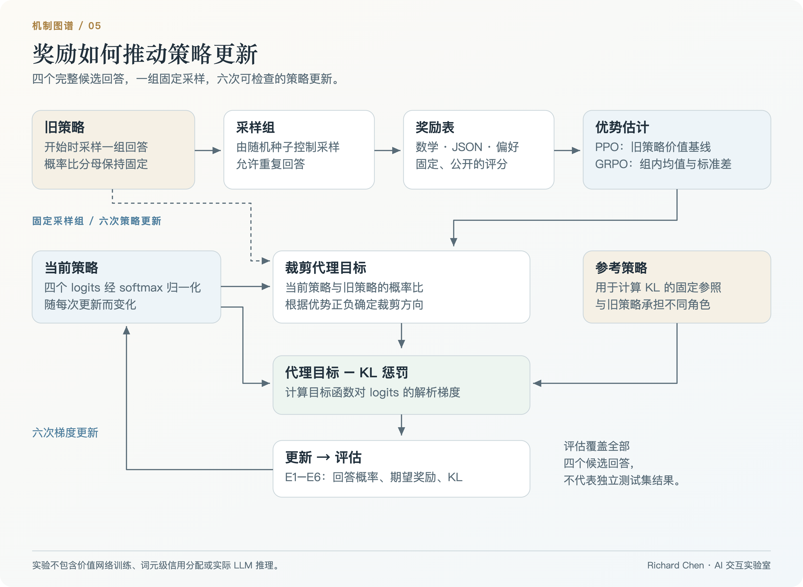

# LLM Reinforcement Learning Lab

**从奖励到策略更新，理解 PPO 与 GRPO 的学习机制。**

用有限候选回答上的可执行实验理解语言模型强化学习：采样回答、获得奖励、计算优势、优化裁剪目标，再检查新策略。小实验中的每一个概率和梯度，都有可追踪的计算依据。

[**进入实验室 ↗**](https://richardchen99.github.io/llm-rl-lab/) · [配套研究笔记](https://richardchen99.github.io/blog/llm-rl-lab-note/) · [English](README.en.md) · [本地运行](#本地运行)

作者：**Richard Chen · 中国人民大学** · [个人主页](https://richardchen99.github.io)

[](https://richardchen99.github.io/llm-rl-lab/)

*真实运行截图。从回答采样到策略更新，逐步检查奖励、优势与有限候选空间上的精确评估。*

## 可以检查的学习信号

| 实验 | 干预 | 观察重点 |
| --- | --- | --- |
| **可复现采样** | 改变随机种子或重新采样 | 重复回答与有限样本波动 |
| **PPO / GRPO** | 切换优势基线 | 相同奖励怎样成为不同学习信号 |
| **策略更新** | 调节采样组大小、学习率、裁剪阈值与 KL 系数 | 六次实际参数更新及概率轨迹 |
| **裁剪机制** | 改变概率比与优势正负 | 目标函数的哪一侧被裁剪 |
| **策略评估** | 对照初始状态 E0 与六次更新 E1–E6 | 四个回答上的精确期望奖励与 KL |

训练概览串联预训练、监督微调（SFT）、回答采样、奖励、策略更新和评估；数值实验聚焦策略更新环节。界面采用英文控件与中文解释，以下操作步骤保留控件原名，便于查找。

## 实验框架



*原创框架图：采样策略与参考策略在同一更新流程中承担不同角色。[可编辑 SVG](docs/assets/architecture.svg) · [图片来源与状态](docs/assets/README.md)。*

## 复现一次六步更新

1. 选择数学验证（**Math verifier**）与 **GRPO**，设置随机种子 **42**、采样组大小 **8**、裁剪阈值 **0.2**、KL 系数 **0.05**、学习率 **0.6**。
2. 依次观察采样、奖励与优势，然后进入策略更新。
3. 到达评估阶段（**Evaluate**），检查 E0–E6。这组配置下，期望奖励约从 **0.378 上升到 0.466**，最终策略相对参考策略的 KL 散度约为 **0.0212**。
4. 固定随机种子与采样组大小，切换 PPO，对照基线变化。
5. 重新采样或修改参数，重新计算更新轨迹；在裁剪实验中选择负优势，并把概率比降到下界以下。

这些数值对应当前有限实验，不是语言模型性能基准。六次更新复用同一采样组；期望奖励在全部四个候选回答上计算，不是独立测试集结果。

<details>
<summary><strong>展开策略变化与优化器截图</strong></summary>


*概率质量在四个完整候选回答之间移动。*


*裁剪与 KL 正则项影响更新方向和幅度，但不保证奖励单调上升。*

</details>

## 奖励任务

| 任务 | 提示词 | 公开评分规则 |
| --- | --- | --- |
| **数学验证** | 求解方程 `3x + 2 = 11`，给出 `x` | 预设候选中，正确答案得 1，错误答案得 0 |
| **JSON 验证** | 计算 `17 + 25`，仅返回含 `answer` 字段的 JSON 对象 | 预设候选中，合法 JSON 且 `answer` 为数值 42 得 1 |
| **偏好奖励** | 向初学者简短解释 KV Cache | 公开给定的准确性与清晰度示例分 |

表中用中文概述提示词含义；界面中的数学与 JSON 提示词保留英文原文。每个任务有四个预设回答与明确奖励表，不调用任意文本验证器、训练奖励模型或在线 LLM。

## 数学机制与实现范围

两个分支共用以下教学目标函数：

$$
J=\frac1G\sum_i\min\left(
\rho_i\hat A_i,\mathrm{clip}(\rho_i,1-\epsilon,1+\epsilon)\hat A_i
\right)-\beta D_{\mathrm{KL}}(\pi_\theta\Vert\pi_{\mathrm{ref}}).
$$

$$
\rho_i=\frac{\pi_\theta(a_i)}{\pi_{\mathrm{old}}(a_i)},\qquad
\hat A_i^{\mathrm{GRPO}}=\frac{r_i-\bar r}{\sigma_r+10^{-8}}.
$$

策略是**四种完整回答上的离散分类分布**，由 softmax 将四个未归一化分数（logits）转为概率。采样、概率比、裁剪代理目标、精确 KL 散度、logits 的解析梯度与参数更新均实际计算。

PPO 分支用旧策略的精确期望奖励作为单步价值基线，不训练价值网络（critic），也不使用广义优势估计（GAE）。GRPO 使用组内总体标准差；组内奖励相同意味着奖励优势为零，但若当前策略偏离参考策略，KL 项仍可起作用。

旧策略决定采样分布与概率比的分母；固定参考策略用于计算 KL 正则项。即使两者初始概率相同，其角色仍不同。裁剪机制随优势正负作用于不同方向，不对策略概率施加硬边界。

实验不包含词元级信用分配、序列长度归一化、分布式采样或完整 LLM 训练。RLHF/RLVR 指反馈来源，PPO/GRPO 指优化方法；典型 DPO 流程不需要相同的在线采样环节。

## 本地运行

推荐 **Node.js 24**，最低支持 22.12。

```bash
git clone https://github.com/richardchen99/llm-rl-lab.git
cd llm-rl-lab
npm ci
npm run dev -- --host 127.0.0.1
```

```bash
npm test
npm run build
npm run preview -- --host 127.0.0.1
```

实验计算在浏览器内完成，无需 API 密钥、模型下载或 GPU。技术栈为 React 19、TypeScript、Vite、Framer Motion 与 KaTeX。

## 实现与验证

| 入口 | 重点 |
| --- | --- |
| [`src/model.ts`](src/model.ts) | 奖励任务、采样、基线、裁剪目标、KL、解析梯度与更新 |
| [`src/App.tsx`](src/App.tsx) | 阶段播放、概率变化、学习轨迹与裁剪实验 |
| [`src/shared.tsx`](src/shared.tsx) · [`src/style.css`](src/style.css) | 公式、动画、玻璃面板与减少动态效果的无障碍支持 |
| [`tests/model.test.mjs`](tests/model.test.mjs) | 采样复现、优势统计、有限差分梯度核对、概率合法性与裁剪方向 |

`npm test` 编译计算模型后，使用 Node 内置测试运行器执行验证。[Pages 工作流](.github/workflows/deploy.yml) 使用 Node 24 完成测试、类型检查、构建与 `main` 分支部署。Fork 仓库后，在 Pages 设置中将部署来源设为 **GitHub Actions** 即可部署。

## 阅读与引用

- Schulman 等：[Proximal Policy Optimization Algorithms](https://arxiv.org/abs/1707.06347)，2017，PPO 与裁剪目标。
- Ouyang 等：[Training language models to follow instructions with human feedback](https://arxiv.org/abs/2203.02155)，2022，指令遵循与 RLHF。
- Shao 等：[DeepSeekMath](https://arxiv.org/abs/2402.03300)，2024，语言模型训练中的 GRPO。
- Rafailov 等：[Direct Preference Optimization](https://arxiv.org/abs/2305.18290)，2023，可对照阅读的偏好优化方法。
- [配套研究笔记](https://richardchen99.github.io/blog/llm-rl-lab-note/)，中文实验导读。

用于课程或文章时，可链接本仓库并记录所用提交版本。[CITATION.cff](CITATION.cff) 提供机器可读的软件署名信息。

## 系列实验室

| 项目 | 核心问题 |
| --- | --- |
| [Tokenizer Playground](https://github.com/richardchen99/tokenizer-playground) | 语料怎样变成可复用词表？ |
| [Transformer Architecture Lab](https://github.com/richardchen99/transformer-architecture-lab) | 注意力怎样将词元表示转为上下文？ |
| [Position Encoding Lab](https://github.com/richardchen99/position-encoding-lab) | 位置怎样改变注意力几何？ |
| [LLM Inference Lab](https://github.com/richardchen99/llm-inference-lab) | 什么条件下可以复用历史计算？ |
| **LLM RL Lab** | 奖励怎样改变回答分布？ |

如果它对你的学习或教学有帮助，欢迎点亮 Star。也欢迎带有明确奖励定义与可验证更新规则的贡献。
